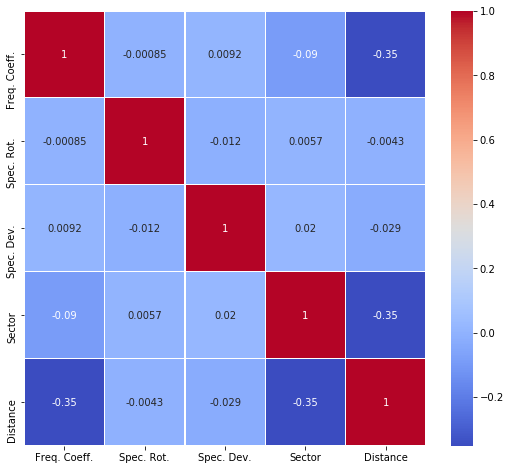
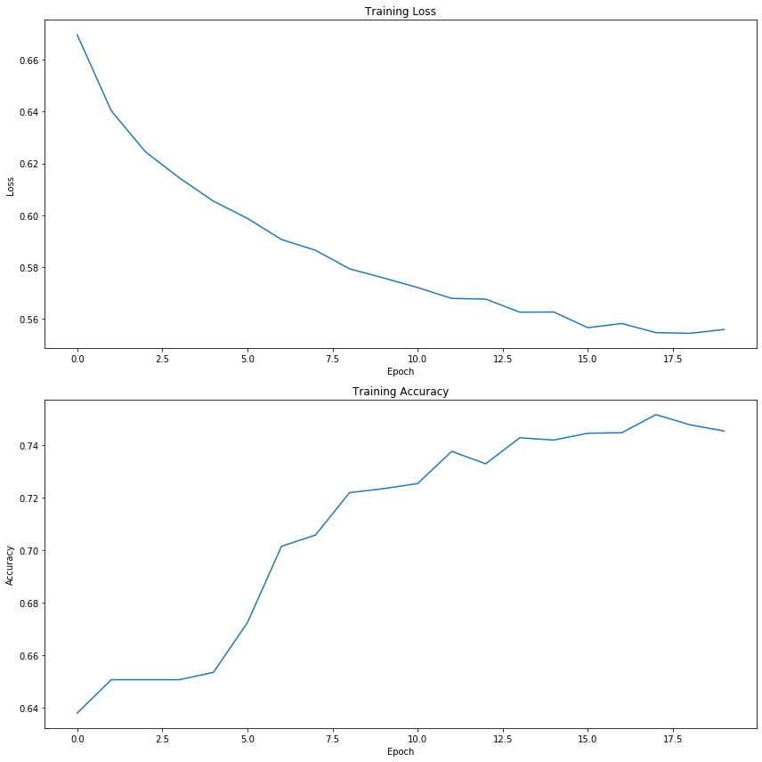

## Classifier: Distinguishing Catheters from their Echoes:

### Language and Libraries:

* Python
* PyTorch
* CUDA
* NumPy

### Necessary Libraries:

```Python
import numpy as np
import pandas as pd
from sklearn.datasets import make_moons
from sklearn.model_selection import train_test_split
import matplotlib.pyplot as plt
import math
import torch
import torchvision
import torchvision.transforms as transforms
import torch.nn as nn
import os
from os import listdir
from os.path import isfile, join
from sklearn.preprocessing import StandardScaler
import matplotlib.pyplot as plt
import gc
from sklearn.metrics import confusion_matrix 
from sklearn.metrics import accuracy_score 
from sklearn.metrics import classification_report 
import matplotlib.patches as patches
from PIL import Image
from mlxtend.plotting import plot_decision_regions
import seaborn as sns
import cv2
import random
```

### Classifier Parameters and Hyperparameters:

```Python
# Hyper-parameter settings
TOTAL_EPOCH = 20
LEARNING_RATE = 0.001
MOMENTUM = 0.9
BATCH_SIZE = 11

class_arr = [0,1]
```

### Sample Training Data:

```Python
pd_dataset = pd.DataFrame({'Freq. Coeff.': mags, 'Spec. Rot.': phases, 'Spec. Dev.': sigs, 'Sector': sectors, 'Distance': distances})
pd_dataset.head(10)
```


### Visualization of Correlation Matrix:

```Python
# Correlation between columns

corr_matrix = pd_dataset.corr()
plt.figure(figsize=(9, 8))
sns.heatmap(data = corr_matrix,cmap='coolwarm', annot=True, linewidths=0.2)
```



### Generate Batch of Training Features:

```Python
# Generate batch of features
group = len(feature_map)/BATCH_SIZE

batch_features = np.split(feature_map, group)
batch_features = np.array(batch_features)
batch_features = torch.from_numpy(batch_features).float()
```

### Generate Batch of Training Classes:

```Python
# Generate batch of classes
group = len(classes)/BATCH_SIZE

batch_classes = np.split(classes, group)
batch_classes = np.array(batch_classes)
batch_classes = torch.from_numpy(batch_classes).long()
```

### Neural Network Summary:

```Python
Net(
  (classifier): Sequential(
    (0): Linear(in_features=120, out_features=50, bias=True)
    (1): BatchNorm1d(50, eps=1e-05, momentum=0.1, affine=True, track_running_stats=True)
    (2): Dropout(p=0.3, inplace=False)
    (3): ReLU()
    (4): Linear(in_features=50, out_features=50, bias=True)
    (5): BatchNorm1d(50, eps=1e-05, momentum=0.1, affine=True, track_running_stats=True)
    (6): Dropout(p=0.2, inplace=False)
    (7): ReLU()
    (8): Linear(in_features=50, out_features=30, bias=True)
    (9): ReLU()
    (10): Linear(in_features=30, out_features=2, bias=True)
    (11): Sigmoid()
  )
)
```

### Visualization of Training Loss and Accuracy:

```Python
# Training accuracy and loss plotting

fig, ax = plt.subplots(2, 1, figsize=(12,12))
ax[0].plot(train_loss)
ax[0].set_xlabel('Epoch')
ax[0].set_ylabel('Loss')
ax[0].set_title('Training Loss')

ax[1].plot(train_accuracy)
ax[1].set_xlabel('Epoch')
ax[1].set_ylabel('Accuracy')
ax[1].set_title('Training Accuracy')

plt.tight_layout()
plt.show()
```



### Generated Predicted Probability for Test Data:

```Python
# Compute neural network output

outputs = net(test_feature_map.to(device))#.to(device)
print(outputs)
```

```Python
tensor([[0.5212, 0.4060],
        [0.2479, 0.7015],
        [0.5775, 0.3875],
        ...,
        [0.5652, 0.3797],
        [0.0066, 0.9936],
        [0.2766, 0.6786]], device='cuda:0', grad_fn=<SigmoidBackward>)
```

# Resources:

https://pytorch.org/

https://developer.nvidia.com/blog/using-shared-memory-cuda-cc
